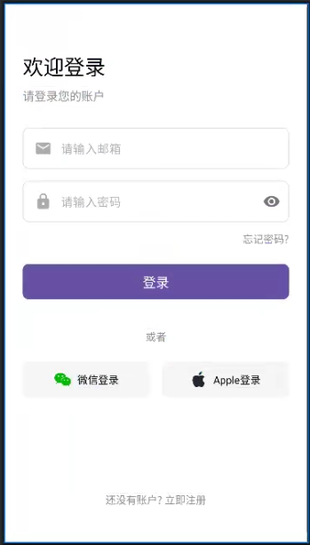
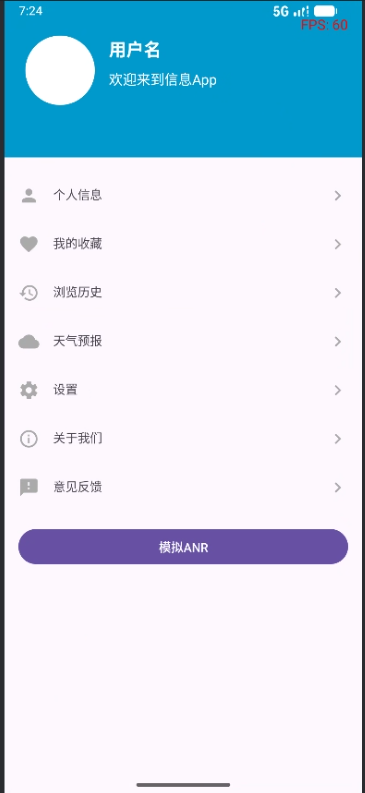
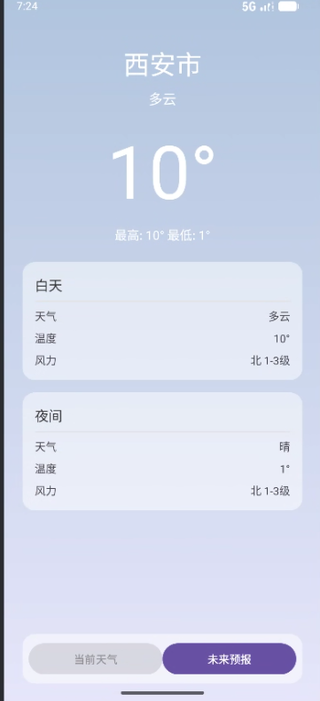
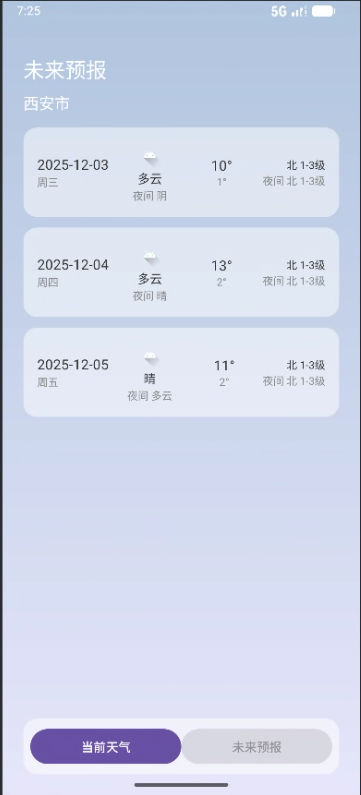
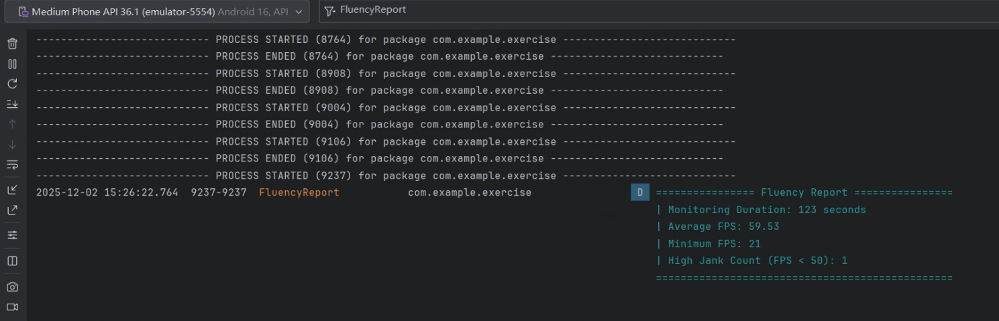
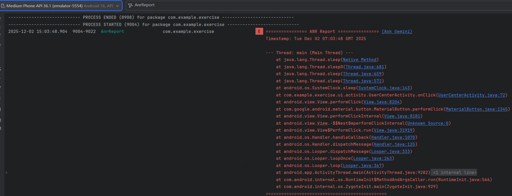

# Exercise App - 登录、个人中心与性能监控

这是一个基础的 Android 应用程序，旨在演示用户登录、个人中心页面的以及天气预报展示的核心功能，并集成了客户端性能监控SDK。应用遵循了现代 Android 开发的基本实践，并采用分层架构以提升代码的可维护性。

## 功能列表

- **用户登录页面**:
  - 提供邮箱和密码输入框。
  - 启动时在输入框中显示默认的测试凭据。
  - 实现登录按钮，点击后验证用户凭据。
  - 登录成功后，跳转到个人中心页面。
  - 包含UI精美的微信和 Apple 第三方登录按钮（仅实现UI和点击提示）。

- **个人中心页面**:
  - 以圆形样式显示用户头像。
  - 显示用户名和个性签名。
  - 包含“个人信息”、“我的收藏”、“天气预报”等多个可点击的列表项。

- **天气预报页面**:
  - 从高德天气API异步获取并展示实时天气与未来预报。
  - 根据天气状况（晴、雨、多云等）动态更换页面背景。
  - 实现了“当前天气”与“未来预报”的标签页切换功能。

- **客户端性能监控SDK**:
  - **流畅性监控 (FPS)**:
    - 在个人中心页面实时显示当前页面的帧率（FPS）。
    - 监控结束时，可在Logcat中生成一份包含**平均/最低帧率**和**高卡顿次数**的性能报告。
  - **ANR（应用无响应）监控**:
    - 应用启动时自动开启ANR监控。
    - 在个人中心页面提供“模拟ANR”按钮，用于测试和触发ANR。
    - 成功捕获ANR后，可在Logcat中生成一份包含**主线程堆栈信息**的诊断报告。

- **数据持久化**:
  - **SQLite**: 用于存储和验证用户的账号和密码。应用启动时，会在数据库中预埋一个默认用户。
  - **SharedPreferences**: 用于存储和读取个人中心的用户名和签名，使其在应用关闭后依然保留。

## 项目文件结构解析

本项目在重构后遵循了清晰的分层架构，将不同职责的代码分离到独立的包中，极大地提升了可读性和可维护性。

### 1. Java 源代码 (`app/src/main/java/com/example/exercise/`)

-   **`MainActivity.java`**: **应用启动器**。
    - 作为应用的唯一入口，负责初始化全局服务（如`AnrMonitor`），然后立即重定向到`LoginActivity`。

-   **`sdk/`**: **客户端性能监控SDK包**。
    -   **`FluencyMonitor.java`**: **流畅性监控核心**。使用`Choreographer` API来精确计算并回调实时FPS，同时具备性能报告生成能力。
    -   **`AnrMonitor.java`**: **ANR监控核心**。采用“看门狗”方案，通过一个后台线程监控主线程的响应状态，以捕获并报告ANR事件。

-   **`ui/`**: **UI层**，包含所有与用户界面相关的代码。
    -   **`activity/`**: 存放所有的Activity。
        -   `LoginActivity.java`: 登录页面控制器。
        -   `UserCenterActivity.java`: 个人中心页面控制器，同时也是SDK功能的集成和测试页面。
        -   `WeatherActivity.java`: 天气预报页面控制器。
    -   **`adapter/`**: 存放RecyclerView的适配器。
        -   `FutureForecastAdapter.java`: 用于展示未来天气预报的列表。

-   **`data/`**: **数据层**，包含所有数据处理、存储和模型相关的代码。
    -   **`UserDatabaseHelper.java`**: **数据库管理核心**。封装了所有与用户SQLite数据库相关的操作。
    -   **`model/`**: 存放所有的POJO数据模型。
        -   `User.java`: 用户数据模型。
        -   `WeatherResponse.java`: 用于Gson解析的天气API响应模型。

### 2. 布局与资源文件

-   **布局文件 (`layout/`)**: 定义了所有Activity和列表项的UI结构。
-   **Drawable 资源 (`drawable/`)**: 包含图标、自定义形状背景等。
    - 新增了`weather_background_sunny.xml`等多个文件，用于实现天气页面的动态背景。

### 3. 应用清单文件 (`AndroidManifest.xml`)

-   注册了应用中所有的Activity，并明确指定了它们在重构后的新包路径（如`.ui.activity.UserCenterActivity`）。
-   通过`<intent-filter>`将`MainActivity`设置为应用的启动入口。

## 开发过程中的挑战与解决方案

在开发此应用的过程中，我遇到并解决了一系列典型但棘手的问题。以下是对这些挑战的回顾：

### 1. 登录逻辑与页面无法跳转

- **问题描述**: 即使用户输入了正确的凭据，也无法登录，系统提示“无效的账号或密码”。

- **排查与解决**: 
  1. **SQL语法错误**: 最初，`checkUser` 方法中的 SQL 查询语句存在微小的语法错误，导致查询总是失败。我通过修正查询语句 (`COLUMN_EMAIL + " = ? AND ..."`) 解决了这个问题。
  2. **数据库初始化冲突**: 修复语法后，问题依然存在。我发现，由于之前错误的代码，数据库中可能已存在一个密码错误的用户记录。之后即使代码被修正，`insertWithOnConflict` 策略也会阻止新的正确数据写入。这是一个典型的数据库状态污染问题。
  3. **最终解决方案**: 最后发现和数据库没有关系，之所以不跳转是因为没有在 AndroidManifest.xml 中注册 `UserCenterActivity`。发现新建的 `LoginActivity` 和 `UserCenterActivity` 没有被注册。根据 Android 的规定，所有 Activity 都必须在清单文件中声明才能被系统启动。我通过添加 `<activity>` 标签解决了这个问题

### 2. 显示页面问题

应该为：

实际为：

- **问题描述**: 登录界面在运行时和预览的不一致。

- **排查与解决**:
  1. **UI控件类型不匹配**: 在一次布局重构后（将社交登录按钮从 `ImageButton` 改为 `LinearLayout`），Java 代码没有同步更新。这导致在 `onCreate` 中调用 `findViewById` 时，试图将一个 `LinearLayout` 强制转换为 `TextView`，引发了 `ClassCastException` 并导致崩溃。我将 Java 代码中的变量类型改为更通用的 `View`，从而解决了类型转换异常。

### 3. 构建失败与资源冲突

- **问题描述**: 项目无法编译，Gradle 报告了 `mergeDebugResources` 或 `parseDebugLocalResources` 失败。

- **排查与解决**:
  1. **资源文件内容为空**: 最初的几次失败是由于创建了空的 drawable XML 文件（如 `apple.xml`），导致资源解析器在解析时出错。我通过填充这些空文件解决了问题。
  2. **Gradle缓存损坏**: 即使修复了空文件，构建依然失败，并提示“This is an internal error in the incremental builds code”。这表明 Gradle 的增量构建缓存已损坏。我通过执行 `gradle clean` 和 `gradle sync`，并最终指导用户使用 Android Studio 的 **"Invalidate Caches / Restart"** 功能，彻底清除了损坏的缓存，解决了这个问题。
  3. **资源名称重复**: 最后，我遇到了“Duplicate resources”错误。这是因为我创建的 `apple.xml` 和 `wechat.xml` 与项目中已存在的 `apple.png` 和 `wechat.png` 文件名冲突。在 Android 中，同一类型的资源（如 drawable）名称必须唯一。我通过删除后创建的 `.xml` 文件，解决了这个冲突。

### 4. 客户端SDK的开发与集成

- **问题描述**: 在开发性能监控SDK时，遇到了从编译、运行到功能实现的一系列挑战。

- **排查与解决**:
  1.  **模块化方案选择**: 最初尝试将SDK创建为一个独立的Gradle模块，但遇到了大量复杂的构建错误（如“找不到符号”、“未配置动态功能”等）。最终，我放弃了这种高成本的方案，转而在主应用内部通过创建`sdk`文件夹来组织代码。这种“代码内模块化”的方案被证明是本项目中最有效、最直接的解决方案。
  2.  **ANR监控方案演进**: 初版的ANR监控采用“通过`logcat`捕获`SIGQUIT`信号”的方案，但这因Android新版本的权限限制而失效。我废弃了该方案，并重新设计和实现了业界标准的**“看门狗”（Watchdog）方案**，通过后台线程监控主线程响应状态，最终稳定、可靠地实现了ANR的捕获。
  3.  **UI遮挡问题**: 在集成了FPS监控后，发现FPS数据无法显示。经排查，原因是XML布局中，显示FPS的`TextView`被上层的其他视图遮挡。通过调整`TextView`在XML文件中的位置，并为其添加`android:elevation`属性以提升其Z轴高度，成功解决了该问题。

## 最终效果

登录界面：

个人中心界面（集成了FPS监控）：

天气预报界面：

FluencyReport：

AnrReport：
