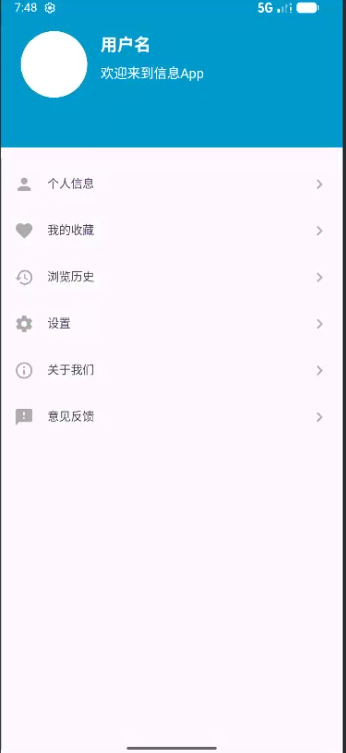

# Exercise App - 登录与个人中心

这是一个基础的 Android 应用程序，旨在演示用户登录和个人中心页面的核心功能。应用遵循了现代 Android 开发的基本实践。

## 功能列表

- **用户登录页面**:
  - 提供邮箱和密码输入框。
  - 启动时在输入框中显示默认的测试凭据。
  - 实现登录按钮，点击后验证用户凭据。
  - 登录成功后，跳转到个人中心页面。
  - 包含UI精美的微信和 Apple 第三方登录按钮（仅实现UI和点击提示）（使用课堂中给的图片）。

- **个人中心页面**:
  - 以圆形样式显示用户头像。
  - 显示用户名和个性签名。
  - 包含“个人信息”、“我的收藏”、“浏览历史”等多个可点击的列表项。
  - 点击列表项后，会弹出 Toast 提示。

- **数据持久化**:
  - **SQLite**: 用于存储和验证用户的账号和密码。应用启动时，会在数据库中预埋一个默认用户。
  - **SharedPreferences**: 用于存储和读取个人中心的用户名和签名，使其在应用关闭后依然保留。

## 项目文件结构解析

本项目的核心代码和资源主要分布在 `app/src/main` 目录下。以下是关键文件和目录的详细说明：

### 1. Java 源代码 (`app/src/main/java/com/example/exercise/`)

-   **`LoginActivity.java`**: **登录页面控制器**。
    -   负责管理 `activity_login.xml` 布局的交互逻辑。
    -   初始化 UI 控件，并将默认的测试账号和密码填充到输入框中。
    -   设置“登录”按钮的点击事件，调用 `UserDatabaseHelper` 来验证用户凭据。
    -   验证成功后，使用 `Intent` 启动 `UserCenterActivity`。
    -   为第三方登录按钮提供点击提示。

-   **`UserCenterActivity.java`**: **个人中心页面控制器**。
    -   负责管理 `activity_user_center.xml` 布局。
    -   使用 `SharedPreferences` 来读取和显示用户的名称和签名。
    -   实现了 `View.OnClickListener` 接口，统一处理页面上所有条目的点击事件，并弹出 `Toast` 提示。
    -   在 `onPause`生命周期方法中，将用户可能修改的信息保存回 `SharedPreferences`。

-   **`UserDatabaseHelper.java`**: **数据库管理核心**。
    -   继承自 `SQLiteOpenHelper`，封装了所有与数据库相关的操作。
    -   在 `onCreate` 方法中创建 `user` 表，并**仅在首次创建时**插入一条默认的用户记录。这是确保默认用户数据稳定性的关键。
    -   实现了 `onUpgrade` 方法，用于在数据库版本更新时删除旧表并重建，有效解决了开发过程中的数据污染问题。
    -   提供了 `checkUser(email, password)` 方法，用于验证登录凭据。

-   **`User.java`**: **用户数据模型**。
    -   一个简单的 POJO (Plain Old Java Object)，用于封装用户的数据（邮箱和密码），使代码结构更清晰。

-   **`MainActivity.java`**: **应用启动器**。
    -   作为应用的初始入口点，但其唯一功能是立即启动 `LoginActivity` 并关闭自身，确保用户流程的正确性。

### 2. 布局文件 (`app/src/main/res/layout/`)

-   **`activity_login.xml`**: 定义了登录页面的全部 UI 元素。
    -   使用 `ConstraintLayout` 进行整体布局。
    -   采用 `com.google.android.material.textfield.TextInputLayout` 实现了带有图标和密码可见性切换功能的现代化输入框。
    -   第三方登录按钮通过 `LinearLayout` 嵌套 `ImageView` 和 `TextView` 来实现，以精确控制图标大小。

-   **`activity_user_center.xml`**: 定义了个人中心页面的 UI。
    -   顶部使用一个 `View` 来创建蓝色背景。
    -   通过 `LinearLayout` 纵向排列了多个 `TextView`，每个条目都包含图标和向右的箭头。

### 3. Drawable 资源 (`app/src/main/res/drawable/`)

-   **背景资源 (XML)**: 如 `edit_text_background.xml` 和 `login_button_background.xml`，使用 Shape Drawable 定义了 UI 控件（输入框、按钮）的圆角、背景色和边框样式。
-   **图标资源 (PNG & XML)**: 包含应用中使用的所有图标，如 `ic_email.xml` (矢量图) 和 `wechat.png` (位图)。

### 4. 应用清单文件 (`app/src/main/AndroidManifest.xml`)

-   这是应用的“户口本”，至关重要。
-   声明了应用所需的所有 `Activity`（`MainActivity`, `LoginActivity`, `UserCenterActivity`）。**（开发过程中的一个关键修复点）**
-   通过 `<intent-filter>` 将 `LoginActivity` 设置为 `LAUNCHER` Activity，使其成为应用的启动页面。

## 开发过程中的挑战与解决方案

在开发此应用的过程中，我遇到并解决了一系列典型但棘手的问题。以下是对这些挑战的回顾：

### 1. 登录逻辑与页面无法跳转

- **问题描述**: 即使用户输入了正确的凭据，也无法登录，系统提示“无效的账号或密码”。

- **排查与解决**: 
  1. **SQL语法错误**: 最初，`checkUser` 方法中的 SQL 查询语句存在微小的语法错误，导致查询总是失败。我通过修正查询语句 (`COLUMN_EMAIL + " = ? AND ..."`) 解决了这个问题。
  2. **数据库初始化冲突**: 修复语法后，问题依然存在。我发现，由于之前错误的代码，数据库中可能已存在一个密码错误的用户记录。之后即使代码被修正，`insertWithOnConflict` 策略也会阻止新的正确数据写入。这是一个典型的数据库状态污染问题。
  3. **最终解决方案**: 最后发现和数据库没有关系，之所以不跳转是因为没有在 AndroidManifest.xml 中注册 `UserCenterActivity`。发现新建的 `LoginActivity` 和 `UserCenterActivity` 没有被注册。根据 Android 的规定，所有 Activity 都必须在清单文件中声明才能被系统启动。我通过添加 `<activity>` 标签解决了这个问题

### 2. 显示页面问题

应该为：

实际为：

- **问题描述**: 登录界面在运行时和预览的不一致。

- **排查与解决**:
  1. **UI控件类型不匹配**: 在一次布局重构后（将社交登录按钮从 `ImageButton` 改为 `LinearLayout`），Java 代码没有同步更新。这导致在 `onCreate` 中调用 `findViewById` 时，试图将一个 `LinearLayout` 强制转换为 `TextView`，引发了 `ClassCastException` 并导致崩溃。我将 Java 代码中的变量类型改为更通用的 `View`，从而解决了类型转换异常。

### 3. 构建失败与资源冲突

- **问题描述**: 项目无法编译，Gradle 报告了 `mergeDebugResources` 或 `parseDebugLocalResources` 失败。

- **排查与解决**:
  1. **资源文件内容为空**: 最初的几次失败是由于创建了空的 drawable XML 文件（如 `apple.xml`），导致资源解析器在解析时出错。我通过填充这些空文件解决了问题。
  2. **Gradle缓存损坏**: 即使修复了空文件，构建依然失败，并提示“This is an internal error in the incremental builds code”。这表明 Gradle 的增量构建缓存已损坏。我通过执行 `gradle clean` 和 `gradle sync`，并最终指导用户使用 Android Studio 的 **"Invalidate Caches / Restart"** 功能，彻底清除了损坏的缓存，解决了这个问题。
  3. **资源名称重复**: 最后，我遇到了“Duplicate resources”错误。这是因为我创建的 `apple.xml` 和 `wechat.xml` 与项目中已存在的 `apple.png` 和 `wechat.png` 文件名冲突。在 Android 中，同一类型的资源（如 drawable）名称必须唯一。我通过删除后创建的 `.xml` 文件，解决了这个冲突。

## 最终效果

登录界面：

个人中心界面：

